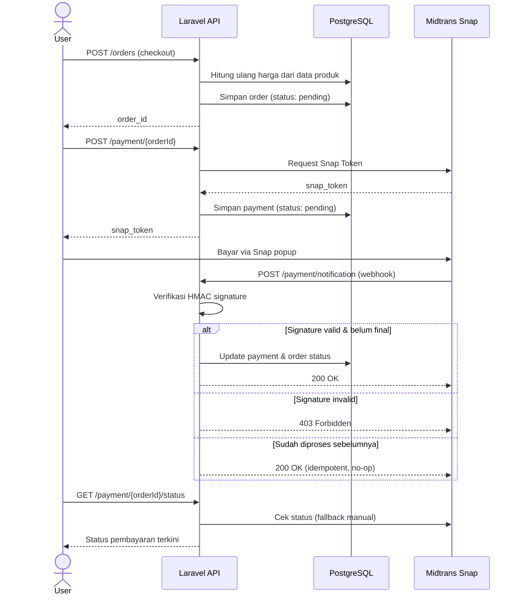
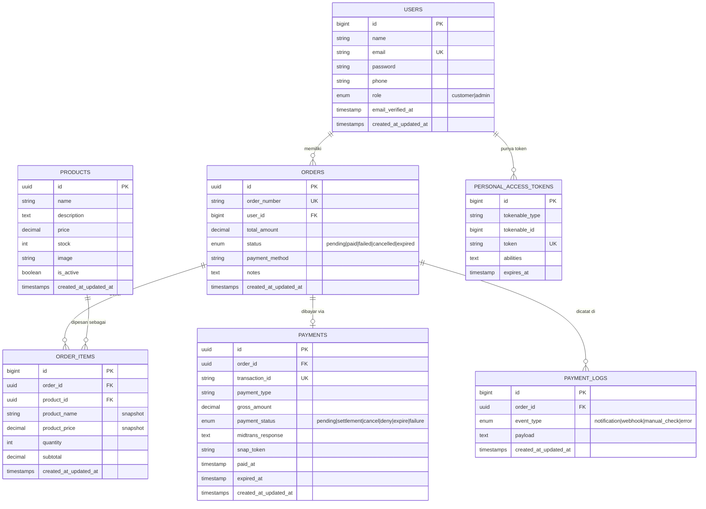

#  Payment Gateway API — E-Commerce Backend

**Backend RESTful API untuk sistem e-commerce dengan integrasi payment gateway Midtrans (Snap API), dibangun dengan Laravel 11.**

Project ini fokus pada tiga hal: (1) alur transaksi e-commerce yang benar dari sisi data (harga dihitung server-side, bukan dari input client), (2) keamanan webhook payment yang sering diremehkan developer pemula, dan (3) idempotency handling supaya sistem tahan terhadap notifikasi duplikat/replay dari payment gateway.

>  **Status project**: Portofolio / Internship Learning Project — dibangun untuk mendalami integrasi payment gateway dan praktik keamanan backend, bukan untuk produksi dengan transaksi nyata.

---

##  Daftar Isi

- [Tech Stack](#-tech-stack)
- [Fitur Utama](#-fitur-utama)
- [Security Highlights](#-security-highlights)
- [Arsitektur & Alur Sistem](#-arsitektur--alur-sistem)
- [Entity Relationship Diagram (ERD)](#-entity-relationship-diagram-erd)
- [Proses Pengembangan (Agile/SDLC)](#-proses-pengembangan-agilesdlc)
- [Instalasi & Setup Lokal](#-instalasi--setup-lokal)
- [Dokumentasi API](#-dokumentasi-api)
- [Struktur Folder](#-struktur-folder)
- [Testing](#-testing)
- [Roadmap](#-roadmap--pengembangan-selanjutnya)
- [Lisensi](#-lisensi)

---

##  Tech Stack

| Kategori | Teknologi |
|---|---|
| Framework | Laravel 11 (PHP 8.2+) |
| Database | PostgreSQL |
| Autentikasi | Laravel Sanctum (Bearer Token) |
| Payment Gateway | Midtrans Snap API (sandbox) |
| Format Response | JSON (REST API) |
| Cloud/Deployment (target) | AWS EC2 (Nginx + PHP-FPM) |

---

##  Fitur Utama

### Autentikasi & User Management
- Register & login dengan token-based authentication (Sanctum)
- Role-based access control (`customer` / `admin`)
- Rate limiting pada endpoint auth untuk mencegah brute force

### Katalog Produk
- List & detail produk (publik, tanpa login)
- CRUD produk (khusus role `admin`)
- Filter berdasarkan status aktif & ketersediaan stok

### Order Management
- Pembuatan order dengan snapshot harga & nama produk (harga tidak berubah walau produk di-update kemudian)
- Harga total dihitung ulang di server, **tidak pernah dipercaya dari input client**
- Ownership check di setiap query — user hanya bisa akses order miliknya sendiri
- Cancel order dengan rollback stok otomatis (database transaction)

### Payment Integration (Midtrans Snap)
- Generate Snap Token untuk pembayaran
- Webhook handler untuk menerima notifikasi status pembayaran dari Midtrans
- Endpoint manual check status pembayaran (fallback kalau webhook gagal terkirim)
- Audit trail lengkap di tabel `payment_logs` untuk setiap event pembayaran

---

##  Security Highlights

Bagian ini sengaja dipisah karena ini yang membedakan project payment gateway "asal jalan" dengan yang benar-benar mempertimbangkan skenario penyalahgunaan.

| # | Isu | Mitigasi |
|---|---|---|
| 1 | Webhook notification bisa dipalsukan siapa saja (endpoint publik tanpa verifikasi) | Verifikasi **HMAC-SHA512 signature** sesuai spesifikasi Midtrans (`order_id + status_code + gross_amount + ServerKey`) sebelum status order/payment diubah |
| 2 | Notifikasi duplikat/replay bisa memproses ulang payment yang sudah final | **Idempotency guard** — payment yang statusnya sudah `settlement`/`failure`/`expire`/`cancel` tidak diproses ulang |
| 3 | Brute force pada login/register | Rate limiting (`throttle:5,1` — maks 5 percobaan/menit per IP) |
| 4 | Manipulasi harga dari sisi client saat checkout | Harga & subtotal dihitung ulang dari data produk di database, input client untuk harga diabaikan |
| 5 | IDOR (user bisa akses order/payment milik user lain) | Setiap query order/payment di-scope dengan `where('user_id', $request->user()->id)` |
| 6 | Data pribadi (nama, email, no. HP) tercatat mentah di log aplikasi | PII di-mask sebelum ditulis ke log (`jo***@gmail.com`, `0812****90`) |
| 7 | Privilege escalation saat registrasi | Role di-hardcode `customer` di server, tidak menerima input role dari client |
| 8 | CORS tidak terkonfigurasi (request dari frontend domain lain diblokir browser) | `config/cors.php` dengan origin yang eksplisit via environment variable, bukan wildcard `*` |

---

##  Arsitektur & Alur Sistem

### Alur Pembayaran (Payment Flow)



### Layered Architecture

```
Client (Postman / Frontend App)
        │
        ▼
   Routes (api.php) ──── Middleware (auth:sanctum, role, throttle)
        │
        ▼
   Controllers (AuthController, OrderController, PaymentController, ProductController)
        │
        ▼
   Form Requests (validasi input: RegisterRequest, LoginRequest, ProductRequest)
        │
        ▼
   Models / Eloquent (User, Product, Order, OrderItem, Payment, PaymentLog)
        │
        ▼
   PostgreSQL Database
        │
        ▼
   External: Midtrans Snap API
```

---

## 🗂 Entity Relationship Diagram (ERD)



**Catatan desain**:
- `products.id`, `orders.id`, dan `payments.id` menggunakan **UUID**, bukan auto-increment — untuk menghindari enumeration attack (menebak ID order/produk lain secara berurutan).
- `order_items` menyimpan **snapshot** nama & harga produk di titik waktu pemesanan, sehingga histori order tetap akurat walau harga produk di-update di kemudian hari.
- `payments` punya relasi **1:1** dengan `orders` (satu order, satu payment record), sementara `payment_logs` **1:banyak** (satu order bisa punya banyak event log dari webhook, manual check, atau error).

---

## 🔄 Proses Pengembangan (Agile/SDLC)

Project ini dikembangkan dengan pendekatan **iteratif berbasis Agile** dalam sprint mingguan, dengan fokus membangun fondasi dulu sebelum menambah kompleksitas fitur pembayaran.

### Sprint 1 — Fondasi & Autentikasi
- Setup project Laravel 11 + koneksi PostgreSQL
- Desain skema database awal (users, products)
- Implementasi register/login dengan Sanctum
- Role-based middleware (`customer` vs `admin`)

### Sprint 2 — Katalog Produk & Order
- CRUD produk dengan validasi (Form Request)
- Skema `orders` & `order_items` dengan snapshot harga
- Endpoint checkout dengan perhitungan harga server-side
- Ownership check di semua endpoint order

### Sprint 3 — Integrasi Payment Gateway
- Integrasi Midtrans Snap API (generate token)
- Webhook handler untuk notifikasi status pembayaran
- Tabel `payment_logs` untuk audit trail

### Sprint 4 — Security Hardening (Code Review Pass)
Sprint ini murni **review & perbaikan**, bukan fitur baru — tahap yang sering dilewatkan project pemula tapi krusial untuk sistem pembayaran:
-  Ditemukan & diperbaiki: webhook tanpa verifikasi signature (celah pemalsuan notifikasi pembayaran)
-  Ditemukan & diperbaiki: exception handling yang mereferensikan class tidak valid (potensi crash saat error dari Midtrans)
-  Ditambahkan: idempotency guard untuk mencegah notifikasi duplikat/replay diproses ulang
-  Ditambahkan: rate limiting pada endpoint autentikasi
-  Ditambahkan: PII masking pada logging
-  Ditambahkan: konfigurasi CORS yang eksplisit

### Backlog / Belum Dikerjakan
- Automated testing (unit & feature test)
- CI/CD pipeline
- Refund handling via Midtrans
- Notifikasi email transaksional (SMTP)

> Pendekatan ini sengaja ditulis transparan — termasuk bagian *"apa yang salah dan bagaimana ditemukan"* — karena itu justru menunjukkan proses berpikir dalam code review, bukan cuma hasil akhir.

---

## ⚙️ Instalasi & Setup Lokal

### Prasyarat
- PHP >= 8.2
- Composer
- PostgreSQL
- Akun [Midtrans Sandbox](https://dashboard.sandbox.midtrans.com/) (gratis, untuk testing)

### Langkah Instalasi

```bash
# 1. Clone repository
git clone <url-repo-anda>
cd payment-gateway-api

# 2. Install dependencies
composer install

# 3. Copy environment file
cp .env.example .env
php artisan key:generate

# 4. Konfigurasi .env
# Isi DB_* sesuai koneksi PostgreSQL lokal Anda
# Isi MIDTRANS_* dengan Server Key & Client Key sandbox Anda sendiri
# Isi FRONTEND_URL sesuai domain frontend yang akan mengakses API ini

# 5. Jalankan migrasi
php artisan migrate

# 6. (Opsional) Seed data awal
php artisan db:seed

# 7. Jalankan server lokal
php artisan serve
```

API akan berjalan di `http://localhost:8000/api`.

### Variabel Lingkungan Penting

```env
DB_CONNECTION=pgsql
DB_HOST=127.0.0.1
DB_PORT=5432
DB_DATABASE=payment_gateway
DB_USERNAME=postgres
DB_PASSWORD=

MIDTRANS_SERVER_KEY=          # Ambil dari dashboard sandbox Anda sendiri, JANGAN commit ke git
MIDTRANS_CLIENT_KEY=
MIDTRANS_IS_PRODUCTION=false

FRONTEND_URL=http://localhost:3000
```

>  **Penting**: `.env` tidak pernah di-commit ke repository (sudah ada di `.gitignore`). Gunakan `.env.example` sebagai template, dan isi key Midtrans dengan kredensial sandbox milik Anda sendiri melalui [dashboard Midtrans](https://dashboard.sandbox.midtrans.com/).

### Setup Webhook untuk Testing Lokal

Midtrans perlu mengirim notifikasi ke URL publik. Untuk testing lokal, gunakan tunnel seperti `ngrok`:

```bash
ngrok http 8000
```

Lalu daftarkan URL ngrok tersebut (`https://xxxx.ngrok.io/api/payment/notification`) di **Dashboard Midtrans Sandbox → Settings → Configuration → Payment Notification URL**.

---

## 📖 Dokumentasi API

Base URL: `/api`

### Autentikasi

| Method | Endpoint | Auth | Deskripsi |
|---|---|---|---|
| POST | `/register` | Publik | Registrasi user baru |
| POST | `/login` | Publik | Login, mengembalikan Bearer token |
| GET | `/user` |  Bearer | Data user yang sedang login |
| POST | `/logout` |  Bearer | Revoke token aktif |

**Contoh Request — Login**
```http
POST /api/login
Content-Type: application/json

{
  "email": "customer@example.com",
  "password": "password123"
}
```

**Contoh Response**
```json
{
  "success": true,
  "message": "Login successful",
  "data": {
    "user": {
      "id": 1,
      "name": "Budi Santoso",
      "email": "customer@example.com",
      "phone": "081234567890",
      "role": "customer"
    },
    "access_token": "1|xxxxxxxxxxxxxxxxxxxx",
    "token_type": "Bearer"
  }
}
```

### Produk

| Method | Endpoint | Auth | Deskripsi |
|---|---|---|---|
| GET | `/products` | Publik | List produk (support `search`, `active`, `in_stock`, `per_page`) |
| GET | `/products/{id}` | Publik | Detail satu produk |
| POST | `/products` |  Admin | Buat produk baru |
| PUT | `/products/{id}` |  Admin | Update produk |
| DELETE | `/products/{id}` |  Admin | Hapus produk |

### Order

| Method | Endpoint | Auth | Deskripsi |
|---|---|---|---|
| GET | `/orders` |  Bearer | List order milik user login |
| POST | `/orders` |  Bearer | Buat order baru (checkout) |
| GET | `/orders/{id}` |  Bearer | Detail order |
| POST | `/orders/{id}/cancel` |  Bearer | Batalkan order (stok dikembalikan) |

### Payment

| Method | Endpoint | Auth | Deskripsi |
|---|---|---|---|
| POST | `/payment/{orderId}` |  Bearer | Generate Snap Token untuk pembayaran |
| GET | `/payment/{orderId}/status` |  Bearer | Cek status pembayaran (manual, fallback) |
| POST | `/payment/notification` | Publik (Midtrans only) | Webhook — menerima notifikasi status dari Midtrans |

> Semua endpoint ` Bearer` membutuhkan header:
> `Authorization: Bearer {access_token}`

---

##  Struktur Folder

```
app/
├── Http/
│   ├── Controllers/Api/
│   │   ├── AuthController.php
│   │   ├── ProductController.php
│   │   ├── OrderController.php
│   │   └── PaymentController.php      ← Signature verification, idempotency guard
│   ├── Middleware/
│   │   ├── CheckRole.php
│   │   └── ForceJsonResponse.php
│   └── Requests/
│       ├── Auth/
│       │   ├── RegisterRequest.php
│       │   └── LoginRequest.php
│       └── ProductRequest.php
├── Models/
│   ├── User.php
│   ├── Product.php
│   ├── Order.php
│   ├── OrderItem.php
│   ├── Payment.php
│   └── PaymentLog.php
└── Traits/
    └── HasUuid.php

config/
├── cors.php                            ← CORS eksplisit, bukan wildcard
├── midtrans.php
└── sanctum.php

database/migrations/                    ← Lihat bagian ERD di atas
routes/
└── api.php
```

---

##  Testing

### Testing Manual via Postman/curl
Alur pengujian yang disarankan:
1. Register → Login (simpan `access_token`)
2. Buat produk (sebagai admin)
3. Checkout produk (sebagai customer) → dapat `order_id`
4. Generate Snap Token via `/payment/{orderId}` → buka `snap_token` di [Midtrans Snap Simulator](https://simulator.sandbox.midtrans.com/)
5. Simulasikan pembayaran, pastikan webhook diterima dan status order berubah jadi `paid`
6. **Kirim ulang notifikasi webhook yang sama** → verifikasi respons idempotent (`"Notification already processed"`, status tidak berubah)

### Rencana Automated Testing (belum diimplementasikan)
- Feature test: alur checkout end-to-end
- Unit test: perhitungan `subtotal`/`total_amount`
- Test khusus: signature verification menolak payload dengan signature invalid

---

## 🗺 Roadmap / Pengembangan Selanjutnya

- [ ] Automated test suite (PHPUnit/Pest)
- [ ] CI/CD pipeline (GitHub Actions)
- [ ] Refund flow via Midtrans
- [ ] Email notification transaksional (SMTP)
- [ ] Custom rate limiter berbasis email (bukan hanya IP) untuk endpoint login
- [ ] API documentation interaktif (Swagger/OpenAPI)

---

##  Lisensi

Project ini dibuat untuk keperluan pembelajaran dan portofolio. Bebas digunakan sebagai referensi belajar.

---

## Author
Said Hamzah
Dikembangkan dengan fokus pada penguatan fundamental keamanan backend dalam sistem pembayaran.
